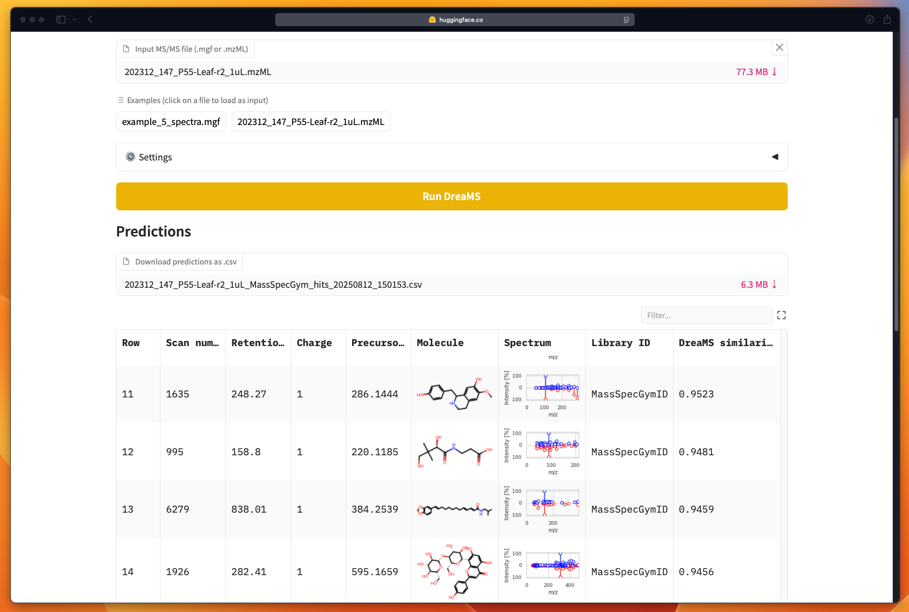

<h1 align="center">DreaMS (Deep Representations Empowering the Annotation of Mass Spectra)</h1>

<!-- [](https://doi.org/10.5281/zenodo.13208732) -->
<!-- [](https://github.com/anton-bushuiev/PPIRef/actions/workflows/python-package.yml) -->

<p>
  <a href="https://doi.org/10.1038/s41587-025-02663-3"></a>
   <a href="https://huggingface.co/spaces/anton-bushuiev/DreaMS"></a>
  <!-- <a href="https://chemrxiv.org/engage/chemrxiv/article-details/6626775021291e5d1d61967f"></a> -->
  <a href='https://dreams-docs.readthedocs.io/en/latest/?badge=latest'></a>
  <a href="https://huggingface.co/datasets/roman-bushuiev/GeMS/tree/main/data"> </a>
  <a href="https://huggingface.co/roman-bushuiev/DreaMS"> </a>
  <a href="https://zenodo.org/records/10997887"></a>
  <a href="https://zenodo.org/records/13843034"></a>
  <a href="https://opensource.org/licenses/MIT"></a>
<p>

<p align="center">
  
</p>

DreaMS (Deep Representations Empowering the Annotation of Mass Spectra) is a transformer-based neural network designed to interpret tandem mass spectrometry (MS/MS) data. Pre-trained in a self-supervised way on millions of unannotated spectra from our new GeMS (GNPS Experimental Mass Spectra) dataset, DreaMS acquires rich molecular representations by predicting masked spectral peaks and chromatographic retention orders. When fine-tuned for tasks such as spectral similarity, chemical properties prediction, and fluorine detection, DreaMS achieves state-of-the-art performance across various mass spectrometry interpretation tasks. The DreaMS Atlas, a comprehensive molecular network comprising 201 million MS/MS spectra annotated with DreaMS representations, along with pre-trained models and training datasets, is publicly accessible for further research and development.

This repository provides the code and tutorials to:

- ⭐ Generate **DreaMS representations** of MS/MS spectra and utilize them for downstream tasks such as spectral similarity prediction or molecular networking.
- ⭐ **Fine-tune DreaMS** for your specific tasks of interest.
- ⭐ Access and utilize the extensive **GeMS dataset** of unannotated MS/MS spectra.
- ⭐ Explore the **DreaMS Atlas**, a molecular network of 201 million MS/MS spectra from diverse MS experiments annotated with DreaMS representations and metadata, such as studied species, experiment descriptions, etc.
- ⭐ Efficiently **cluster MS/MS spectra** in linear time using locality-sensitive hashing (LSH).

Additionally, for further research and development:
- ⭐ Convert conventional MS/MS data formats into our new, **ML-friendly HDF5-based format**.
- ⭐ Split MS/MS datasets into training and validation folds using **Murcko histograms** of molecular structures.

📚 Please refer our [tutorials/documentation](https://dreams-docs.readthedocs.io/) and paper ["Self-supervised learning of molecular representations from millions of tandem mass spectra using DreaMS"](https://www.nature.com/articles/s41587-025-02663-3) for more details.

## Web app on Hugging Face Spaces 🤗

A simple web app is available on [Hugging Face Spaces](https://huggingface.co/spaces/anton-bushuiev/DreaMS). You can use the app to perform spectral library
matching for your MS/MS spectra based on DreaMS embedding similarity in one click.



## Getting started locally

### Installation
Run the following code from the command line.

``` shell
# Download this repository
git clone https://github.com/pluskal-lab/DreaMS.git
cd DreaMS

# Create conda environment
conda create -n dreams python==3.11.0 --yes
conda activate dreams

# Install DreaMS
pip install -e .
```

If you are not familiar with conda or do not have it installed, please refer to the [official documentation](https://conda.io/projects/conda/en/latest/user-guide/getting-started.html).

### Compute DreaMS representations

To compute DreaMS representations for MS/MS spectra from `.mgf` file, run the following Python code.

``` python
from dreams.api import dreams_embeddings
embs = dreams_embeddings('data/examples/example_5_spectra.mgf')
```

The resulting `embs` object is a matrix with 5 rows and 1024 columns, representing 5 1024-dimensional DreaMS representations for 5 input spectra stored in the `.mgf` file.

## References

- Paper: [https://www.nature.com/articles/s41587-025-02663-3](https://www.nature.com/articles/s41587-025-02663-3).
- Pre-print: [https://chemrxiv.org/engage/chemrxiv/article-details/6626775021291e5d1d61967f](https://chemrxiv.org/engage/chemrxiv/article-details/6626775021291e5d1d61967f).
- Web app on Hugging Face Spaces: [https://huggingface.co/spaces/anton-bushuiev/DreaMS](https://huggingface.co/spaces/anton-bushuiev/DreaMS).
- Documentation and tutorials: [https://dreams-docs.readthedocs.io/](https://dreams-docs.readthedocs.io/).
- Weights of pre-trained models: [https://zenodo.org/records/10997887](https://zenodo.org/records/10997887).
- Datasets:
  - GeMS dataset: [https://huggingface.co/datasets/roman-bushuiev/GeMS/tree/main/data](https://huggingface.co/datasets/roman-bushuiev/GeMS/tree/main/data).
  - DreaMS Atlas: [https://huggingface.co/datasets/roman-bushuiev/GeMS/tree/main/data/DreaMS_Atlas](https://huggingface.co/datasets/roman-bushuiev/GeMS/tree/main/data/DreaMS_Atlas).
  - Labeled MS/MS spectra: [https://huggingface.co/datasets/roman-bushuiev/GeMS/tree/main/data/auxiliary](https://huggingface.co/datasets/roman-bushuiev/GeMS/tree/main/data/auxiliary).

If you use DreaMS in your research, please cite the following paper:

```bibtex
@article{bushuiev2025selfsupervised,
  author={Bushuiev, Roman
  and Bushuiev, Anton
  and Samusevich, Raman
  and Brungs, Corinna
  and Sivic, Josef
  and Pluskal, Tom{\'a}{\v{s}}},
  title={Self-supervised learning of molecular representations from millions of tandem mass spectra using DreaMS},
  journal={Nature Biotechnology},
  year={2025},
  month={May},
  day={23},
  abstract={Characterizing biological and environmental samples at a molecular level primarily uses tandem mass spectroscopy (MS/MS), yet the interpretation of tandem mass spectra from untargeted metabolomics experiments remains a challenge. Existing computational methods for predictions from mass spectra rely on limited spectral libraries and on hard-coded human expertise. Here we introduce a transformer-based neural network pre-trained in a self-supervised way on millions of unannotated tandem mass spectra from our GNPS Experimental Mass Spectra (GeMS) dataset mined from the MassIVE GNPS repository. We show that pre-training our model to predict masked spectral peaks and chromatographic retention orders leads to the emergence of rich representations of molecular structures, which we named Deep Representations Empowering the Annotation of Mass Spectra (DreaMS). Further fine-tuning the neural network yields state-of-the-art performance across a variety of tasks. We make our new dataset and model available to the community and release the DreaMS Atlas---a molecular network of 201 million MS/MS spectra constructed using DreaMS annotations.},
  issn={1546-1696},
  doi={10.1038/s41587-025-02663-3},
  url={https://doi.org/10.1038/s41587-025-02663-3}
}
```